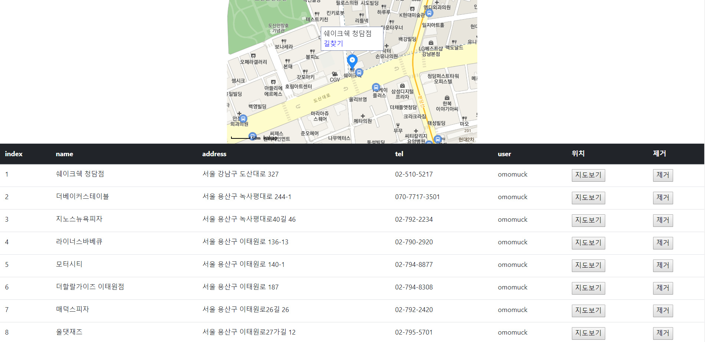
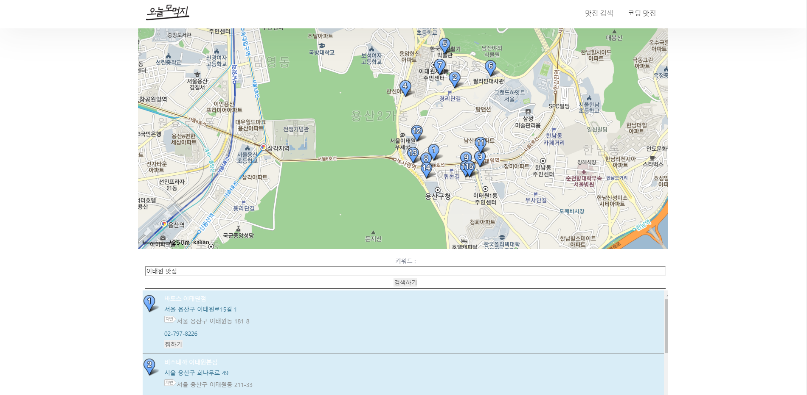
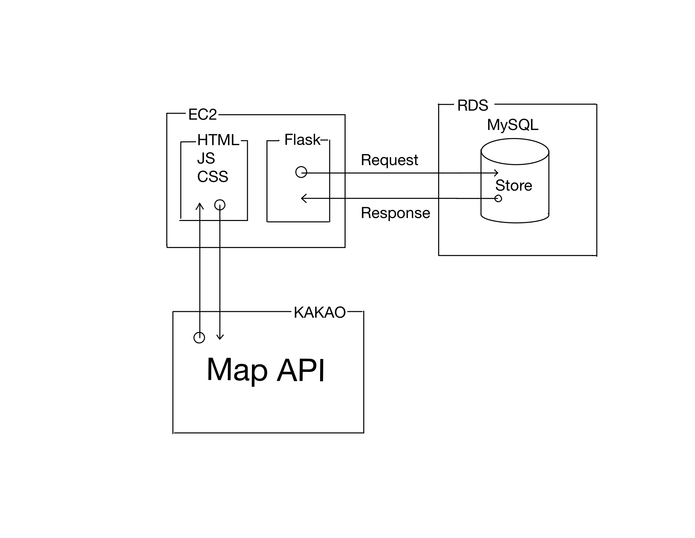

&#127831; omomuck project
=======
~~~
Python Flask를 이용한 웹 프로젝트 오늘 뭐 먹지? (오모먹) 입니다.
~~~
### 프로젝트 소개
* 맛집을 지역 위주로 검색하여 나의 리스트에 '찜하기'!

### 오모먹 주소
http://www.omomouck.shop

### 스크린샷

=======

=======
### 아키텍처

=======

### 참고 자료
* 파이썬 모듈 관리 :
https://www.opentutorials.org/module/4003/24539

* git 사용법 :
https://rogerdudler.github.io/git-guide/index.ko.html

* mac에서 mysql 설치 :
https://whitepaek.tistory.com/16

* mac에서 mysql-workbench 설치:
https://devyurim.github.io/data%20base/mysql/2018/08/13/mysql-1.html

* Rds 설치방법:
https://ndb796.tistory.com/226
(ALTER TABLE stores CONVERT TO character SET utf8;)

### 함께 한 사람
오현택: https://github.com/tax1116  
김태범: https://github.com/perikles7777
